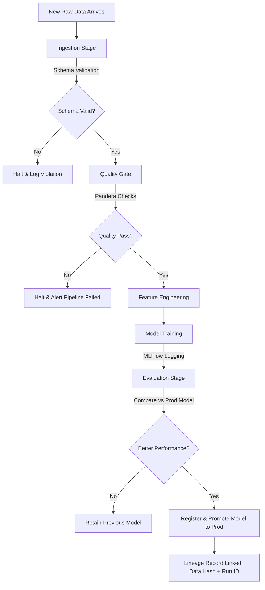

# Architecture Design

FlowTrace is designed entirely around an explicit, failure-sensitive Directed Acyclic Graph (DAG). 

## Unified System Journey

## Components
- **Prefect Orchestrator**: Wraps Python functions into stages (`@task`) and combines them in an executable pipeline (`@flow`).
- **Pandera Validator**: Intercepts the Pandas DataFrame directly after ingestion, asserting bounds, typings, and non-null guarantees.
- **MLflow Tracker**: Operates as a background context manager during the Training and Evaluation phases to commit metrics and parameters to a local SQLite registry.